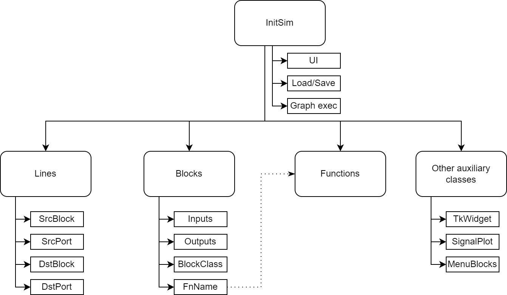

Using DiaBloS: Developer Guide
==============================

Software hierarchy
------------------

Explicar con diagramas la relacion entre funciones principales

Explicar cada cuadrado grande y bajo este los cuadrados chicos

..  main_execution()
        --main classes--
        initsim
            --UI--
            add_block
            remove_block
            add_line
            remove_lines
        --settings--
            save
            open
            other settings
            canvas resolution
            canvas fps
        --execution--
            execution_init
            execution_loop
            other auxiliar functions

..      blocks
            --internal--
            inputs
            outputs
            parameters
            function (internal/external)
            --ui--
            color

..      lines
            --internal--
            start
            end
            --ui--
            color
            trajectory

..      functions
            --execution--
            input/output functions

..      --auxiliar classes--
            tkWidget
            menublocks
            signal_plot

Graph simulation
----------------

Explicar de forma resumida el como se ejecutan los datos, tal vez un hipervinculo al paper?

.. _simrun:

-------------------------------
Graph simulation main algorithm
-------------------------------

Explicar el loop de ejecucion del grafo, inicial y loop, con tambien los casos para detenerlo de golpe (diagrama)

poner la explicacion vista con el profe::

    Based on paper

    2 steps, init and loop

    init:
        -sort blocks according to computability.
        -start with source blocks.
        -spread initial conditions for blocks that use it (integrator).
        -check what blocks can be computed, compute them and spread its outputs to other uncomputed blocks.
        Then assign the order position to that block for the next step.

    loop:
        -spread output from blocks with initial conditions.
        -execute every block in the other already defined in the previous part, then spread outputs to other uncomputed blocks.

    stop:
        -wait until the time variable reaches the limit.
        -press STOP button in the interface.

.. _rk45-method:

---------------------------------
RK45 integration method algorithm
---------------------------------

Explicar las cosas que hacen que funcione el RK45

The RungeKutta 45 integration method can be defined as the following:

    .. math:: y(t) \approx (k_1 + 2k_2 + 2k_3 +k_4) \Delta T

    where T is the ..., y(t), and ... f(x)...

    .. math:: k_1 &= \Delta T \cdot f\left(t,x\right) \\
        k_2 &= \Delta T \cdot f\left(t + \frac{\Delta T}{2}, x + \frac{k_1}{2}\right) \\
        k_3 &= \Delta T \cdot f\left(t + \frac{\Delta T}{2}, x + \frac{k_2}{2}\right) \\
        k_4 &= \Delta T \cdot f\left(t + \Delta T, x + k_3\right)

    where f...

*Comparar integracion RK45 con Euler usando RMS
*Comparar con integrador en matlab, mismo ejemplo
*Ver opcion para cambiar paleta de colores en pyqtgraph
*

Data management
---------------

Explicar como los datos se empaquetan para la comunicacion entre bloques.
Hacer un diagrama de al menos 4 bloques para explicar el como se van agregando y saliendo
Explicar la forma en que los vectores se van creando

----------------------------
Communication between blocks
----------------------------

Mencionar el como funciona lo de los diccionarios::

    return {0: np.array(dato), 1: np.array([dato1,dato2])}

-----------------
Vector management
-----------------

Explicación de cómo se construyen los vectores.

vector: [a, b, c, d]
matrix: [[a, b], [c, d]]
3d-matrix: [[[a, b], [c, d]], [[e, f], [g, h]]]

TkWidget.string_to_vector(): proceso de conversion de vectores en string.

* En ambos procesos se eliminan los espacios, solo importan los valores numéricos, como los corchetes y espacios ('[', ']', ' ')

1) Se eliminan los valores numéricos y se observa el número de corchetes para determinar las dimensiones del potencial vector/matriz.

2) Se eliminan los corchetes, creando un único vector que se redimensiona con los valores resultantes del proceso anterior.

* Si el número de elementos en el vector no corresponde a las dimensiones del vector/matriz, se indica un error y se entrega un "''".

.. _usermodel-function:

Usermodel functions
-------------------

Explicar el proceso de crear estas funciones.
Requieren saber el cómo se comunican los datos y su formato.
Como testear

----------------------
Creating new functions
----------------------

Como desarrollar nuevas funciones de usuario (ver templates)::

    # filename: my_function.py
    """import libraries"""

    def my_function(time, inputs, params):
        """function code, either source, N_process, Z_process or drain"""
        return {0: variable_output, 1: variable_output, ..., 'E': True/False}

Funcion inicialización::

    def _init_():
        io_data = { # parameters for the block containing the function
            'inputs': input_number,
            'outputs': output_number,
            'b_type': block_type_number, #0: source, #1: N_process, #2: Z_process, #3: drain
            'color': color_string_or_rgb_triplet
        }
        params = {} # default parameters defined for the function
        return io_data, params

---------------------
Testing new functions
---------------------

It is recommended to implement this function as an external-function type first, then add it to the Functions class.

#. First define inputs, outputs, block type and block color in the external function file "_init_" and implement the most simplified version of the function to add.

#. After that, create a simple graph diagram to test the new block. i.e: A Step block, connected to the external block (where the new function is implemented), connected to a Scope block.

#. If the system doesn't fail execution, add new elements to the external function being aware of not breaking the graph execution stability.

#. When everything is ok, add the new finished function to the Functions class and create a new MenuBlock in InitSim.menu_blocks_init(), using the parameters already defined in the external function "_init_" and defining block size and if the function allows change of inputs and/or outputs.

#. Test again the function in the simulation, this time replacing the External Block with the corresponding to the new implemented function.

------------------
Preventing crashes
------------------

Agregar casos de excepcion retornando una 'E'. De ese modo, la simulacion podrá detener la ejecucion sin terminar el
programa repentinamente::

    except:
        return {'E': True}

.. raw:: latex

    \newpage