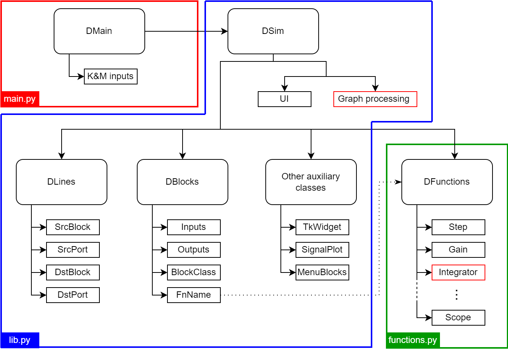

Using DiaBloS: Developer Guide
==============================

Software hierarchy
------------------

A hierarchical diagram of the tool's main classes and functions is presented in the following figure, and a description of its most important classes and functions of this software library is presented below:

* DMain: Executes the main whileloop of the interface from the moment the program starts. It calls the DSim class and handles the data input from the user.
* DSim: Class that controls and executes the main functions of the interface, such as creating block and link objects, simulating the block diagram, opening and saving files, and loading the graphical representations of the elements in the interface.
* DBlocks: Class that defines each node or block of the network as an object with a finite number of inputs and outputs, color, type of block (source, zprocess, nprocess, terminal), associated function, among others. In addition, as an object, it contains the variables associated to the executable function, independently from other blocks of the same type.
* DLine: Class that defines the link between blocks as an object with start and end, both identified as a block-port pair. It also controls the segmentation of a line for graphical effects, such as changing its color in the interface.
* DFunctions: Class that contains all the default functions associated to the blocks created in the system. These functions have no memory, since this information is contained in each block created under DBlocks, they only calculate data and provide a result.
* Auxiliary classes: TkWidget, SignalPlot, MenuBlocks. These are classes with specific functionalities to support the use of the tool by the user. e.g.: Plot curves, change parameters, create blocks in the interface.

The creation of blocks and functions as independent elements is supported by the idea of facilitating the production process. In most cases, a block only requires the name of the function to be associated and the main parameters to obtain a functional node in the diagram, making it unique from the rest. This also allows the creation of external functions to those already available in the library, allowing the user to create more complex processes, simplifying the elaboration of diagrams, if required.

Graph simulation algorithm
--------------------------

The algorithm to simulate a block diagram is based on the following paper: [XXXXX]

Data management
---------------

----------------------------
Communication between blocks
----------------------------

Data sent and received by blocks, has to be packaged inside a dictionary. This dictionary only has integer numbers as keys, requiring as many as the number of output ports a block has. e.g: A function linked with a block with two outputs would likely return a dictionary like the following::

    return {0: np.array(data0), 1: np.array([data1,data2])}

The values for each key only supports numpy array variables. Although, there is no actual restriction for the format as long as the block receiving this data can process it.

There is one exception for keys. The key 'E' is used to indicate an error happened while executing a function and the simulation must be stopped. More details about using this particular key are presented in :ref:`developer:creating new functions`.

-----------------
Vector management
-----------------

Currently DiaBloS supports vectors up to 3 DOF:

#) Vector form: [a, b, c, d]
#) Matrix form: [[a, b], [c, d]]
#) 3D-matrix form: [[[a, b], [c, d]], [[e, f], [g, h]]]

TkWidget.string_to_vector(): proceso de conversion de vectores en string.

* En ambos procesos se eliminan los espacios, solo importan los valores numéricos, como los corchetes y espacios ('[', ']', ' ')

1) Se eliminan los valores numéricos y se observa el número de corchetes para determinar las dimensiones del potencial vector/matriz.

2) Se eliminan los corchetes, creando un único vector que se redimensiona con los valores resultantes del proceso anterior.

* Si el número de elementos en el vector no corresponde a las dimensiones del vector/matriz, se indica un error y se entrega un "''".

Usermodel functions
-------------------

DiaBloS supports the use of usermade functions, which can be accessed in the block diagram with the External block.

Two functions
-main function: execution
-init function: block and function default parameters

----------------------
Creating new functions
----------------------

Como desarrollar nuevas funciones de usuario (ver templates)::

    # filename: my_function.py
    """import libraries"""

    def my_function(time, inputs, params):
        """function code, either source, N_process, Z_process or drain"""
        return {0: variable_output, 1: variable_output, ..., 'E': True/False}

Funcion inicialización::

    def _init_():
        io_data = { # parameters for the block containing the function
            'inputs': input_number,
            'outputs': output_number,
            'b_type': block_type_number, #0: source, #1: N_process, #2: Z_process, #3: drain
            'color': color_string_or_rgb_triplet
        }
        params = {} # default parameters defined for the function
        return io_data, params

Uso de except for errors::

    except:
        return {'E': True}

---------------------
Testing new functions
---------------------

It is recommended to implement this function as an external-function type first, then add it to the Functions class.

#. First define inputs, outputs, block type and block color in the external function file "_init_" and implement the most simplified version of the function to add.

#. After that, create a simple graph diagram to test the new block. i.e: A Step block, connected to the external block (where the new function is implemented), connected to a Scope block.

#. If the system doesn't fail execution, add new elements to the external function being aware of not breaking the graph execution stability.

#. When everything is ok, add the new finished function to the Functions class and create a new MenuBlock in InitSim.menu_blocks_init(), using the parameters already defined in the external function "_init_" and defining block size and if the function allows change of inputs and/or outputs.

#. Test again the function in the simulation, this time replacing the External Block with the corresponding to the new implemented function.

.. raw:: latex

    \newpage