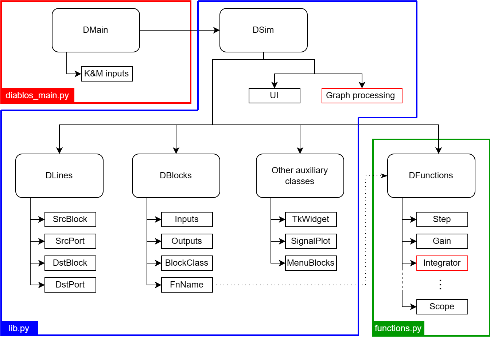

Using DiaBloS: Developer Guide
==============================

Software hierarchy
------------------

A hierarchical diagram of the tool's main classes and functions is presented in the following figure, and a description of its most important classes and functions of this software library is presented below:

* DMain:
    Executes the main whileloop of the interface from the moment the program starts. It calls the DSim class and handles the data input from the user.
* DSim:
    Class that controls and executes the main functions of the interface, such as creating block and link objects, simulating the block diagram, opening and saving files, and loading the graphical representations of the elements in the interface.
* DBlocks:
    Class that defines each node or block of the network as an object with a finite number of inputs and outputs, color, type of block (source, zprocess, nprocess, terminal), associated function, among others. In addition, as an object, it contains the variables associated to the executable function, independently from other blocks of the same type.
* DLine:
    Class that defines the link between blocks as an object with start and end, both identified as a block-port pair. It also controls the segmentation of a line for graphical effects, such as changing its color in the interface.
* DFunctions:
    Class that contains as methods all the default functions associated to the blocks created in the system. These functions have no memory, since this information is contained in each block created under DBlocks, they only calculate data and provide a result.
* Auxiliary classes (:func:`TkWidget`, :func:`SignalPlot`, :func:`MenuBlocks`):
    These are classes with specific functionalities to support the use of the tool by the user. i.e.: Plot curves, change parameters, create blocks in the interface.

The creation of blocks and functions as independent elements is supported by the idea of facilitating the production process. In most cases, a block only requires the name of the function to be associated and the main parameters to obtain a functional node in the diagram, making it unique from the rest. This also allows the creation of external functions to those already available in the library, allowing the user to create more complex processes, simplifying the elaboration of diagrams, if required.

Graph simulation algorithm
--------------------------

The algorithm to simulate a block diagram, will be posted soon.

.. is based on the following paper: [XXXXX]

Data management
---------------

----------------------------
Communication between blocks
----------------------------

Data sent and received by blocks, has to be packaged inside a dictionary. This dictionary only has integer numbers as keys, requiring as many as the number of output ports a block has. e.g: A function linked with a block with two outputs would likely return a dictionary like the following::

    return {0: np.array(data0), 1: np.array([data1,data2])}

The values for each key only supports numpy array variables. Although, there is no actual restriction for the format as long as the block receiving this data can process it.

There is one exception for keys. The key ``'E'`` is used to indicate an error happened while executing a function and the simulation must be stopped. More details about using this particular key are presented in :ref:`developer:creating new functions`.

-----------------
Vector management
-----------------

Currently DiaBloS supports vectors up to 3 D.O.F.::

    1. Vector form: [a, b, c, d]
    2. Matrix form: [[a, b], [c, d]]
    3. 3D-matrix form: [[[a, b], [c, d]], [[e, f], [g, h]]]

The process which a string is converted to ``numpy.ndarray`` format is explained below:

* The :func:`TkWidget` class is responsible for creating windows to edit parameter values for each block. The :func:`string_to_vector()` method converts strings identified as vectors, which start and end with ``[`` and ``]``, respectively.

* A copy of the original string is made by removing the numeric values and spaces, to count the number of square brackets and thus determine the dimensions of the vector/matrix.

* A second copy of the original string is made, this time removing the square brackets and spaces, creating a single vector that is resized with the values resulting from the previous process, as well as checking that all values within the vector are numeric.

* If the number of elements in the vector does not correspond to the dimensions of the vector/matrix, an error is indicated and a ``NaN`` is returned, retaining its previous value.

Usermodel functions
-------------------

DiaBloS supports the use of usermade functions, which can be accessed in the block diagram with the External block. Usermodel functions files are composed of two functions:

#. Execution function:
    Function executed when a block diagram is simulated. The equivalent to the functions implemented as methods of the DFunctions class.

    It is important that the name of this function and the ``.py`` file are the same, otherwise the function will not be associated to the External block.

#. Initialization function:
    Function containing parameters to update the External block associated with the execution function. It only contains two dictionaries:

    #. ``io_data``: Dictionary containing port and process type data. I.e.: Number of input and output ports, block type, block color.
    #. ``params``: Dictionary containing the default parameters needed for the execution function. I.e.: ``_init_start_``.

* If auxiliary functions to the execution function are needed, they can be added to the same file.
* If a library is required to perform a process, simply import it from the file at the beginning.

----------------------
Creating new functions
----------------------

A generic layout for a user-made function named :func:`my_function()` is presented below:

* Execution function :func:`my_function()`::

    # filename: my_function.py
    """import libraries"""

    def my_function(time, inputs, params):
        """function code, either source, N_process, Z_process or drain"""
        if params['_init_start_']:
            """commands that must be executed in first execution loop only"""

            params['_init_start_'] = False
        """commands that always must be executed"""

        return {0: variable_output0, 1: variable_output1, ...} # return values that must be sent to other blocks.

* Initialization function :func:`_init_()`::

    def _init_():
        io_data = { # parameters for the block associated with the function
            'inputs': input_value,
            'outputs': output_value,
            'b_type': block_type_value, #0: source, #1: N_process, #2: Z_process, #3: drain
            'color': color_string_or_rgb_triplet #(r,g,b), 'red'
        }
        params = { # default parameters defined for the function
            'parameter0': value,
            '_init_start_': True
        }
        return io_data, params

* Use of ``except`` to display messages in the command console for errors::

    ...
    try:
        """normal process"""
    except:
        """Commands to do if there's an error in the process. i.e: printing "ERROR" in the terminal."""
        return {'E': True} # error happened, returns a flag to stop the block diagram's simulation.
    ...

There are templates available in ``usermodels/templates`` folder for each type of block to simulate.

------------------------------
Tips for testing new functions
------------------------------

#. It is recommended to implement this function as an external-function type first, then add it as a method of the Functions class.

#. First define inputs, outputs, block type and block color in the external function file :func:`_init_` and implement the most simplified version of the function to add.

#. After that, create a simple graph diagram to test the new block. i.e: A Step block, connected to the external block (where the new function is implemented), connected to a Scope block.

#. If the system doesn't fail execution, add new elements to the external function being aware of not breaking the simulation stability.

#. When everything is ok, add the new finished function to the Functions class and create a new MenuBlock in :func:`InitSim.menu_blocks_init()`, using the parameters already defined in the external function :func:`_init_`, defining block size and if the function allows change of inputs and/or outputs.

#. Test again the function in the simulation, this time replacing the External Block with the corresponding to the new implemented function.

.. raw:: latex

    \newpage